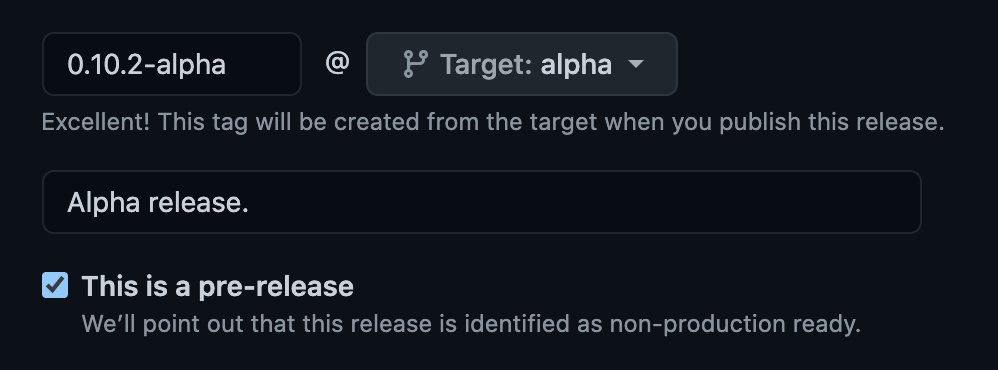

## Contributing

Pull requests for bug fixes are welcome, but before submitting new features or changes to current functionality, [open an issue](https://github.com/DataDog/datadog-ci/issues/new)
and discuss your ideas or propose the changes you wish to make. After a resolution is reached, a PR can be submitted for review.

### Running command in development environment

When developing the tool, it is possible to run commands using `yarn launch`. It relies on `ts-node`, so does not require building the project for every new change.

```bash
yarn launch synthetics run-tests --config dev/global.config.json
```

### Framework and libraries used

- [clipanion](https://github.com/arcanis/clipanion): CLI library to handle the different commands.
- [eslint](https://github.com/eslint/eslint): Linting ([.eslintrc.js](/.eslintrc.js)).
- [jest](https://github.com/facebook/jest): Tests are written in Jest.
- [volta](https://github.com/volta-cli/volta): NodeJS and yarn versioning.

### Creating a new command

Follow the [Structure](#structure) below for any commands you add. Then, don't forget the [Things to update](#things-to-update) in the project.

#### Structure

Commands are stored in the [src/commands](src/commands) folder.

The skeleton of a command is composed of a README, an `index.ts` and a folder for the tests.

```bash
src/
└── commands/
    └── fakeCommand/
         ├── __tests__/
         │   └── index.test.ts
         ├── README.md
         └── index.ts
```

The `index.ts` file must export classes extending the `Command` class of `clipanion`. The commands of all `src/commands/*/index.ts` files will then be imported and made available in the `datadog-ci` tool.

A sample `index.ts` file for a new command would be:

```typescript
import {Command} from 'clipanion'

export class HelloWorldCommand extends Command {
  public async execute() {
    this.context.stdout.write('Hello world!')
  }
}

module.exports = [HelloWorldCommand]
```

Lastly, unit tests must be created in the `__tests__/` folder. The tests can then be launched with the `yarn test` command: it finds all files with a filename ending in `.test.ts` in the repo and executes them.

#### Beta command

If your command is related to a beta product or feature, or you want to test out the command first, you can mark your command as beta.

To do so, add your command's name to the [`BETA_COMMANDS` array](https://github.com/DataDog/datadog-ci/blob/35c54e1d1e991d21461084ef2e346ca1c6bb7ea6/src/cli.ts#L8).

Users have to prefix their command line with `DD_BETA_COMMANDS_ENABLED=1` to use the command. Make sure to document this in your command's README for visibility. This should be removed once the command goes out of beta.

Optionally, you can create a pre-release for your command by following the [Pre-Release Process](#pre-release-process) instructions below.

#### Things to update

- The [Usage section in the root README](README.md#usage) must be updated to link to:
  - The new command's README.
  - And 📚 should link to the official Datadog documentation site.
  - **Note:** If your command is beta, use the [Beta commands](README.md#beta-commands) section instead.

- The command should be added under the right product in the [CODEOWNERS](.github/CODEOWNERS) file to ensure the right people are notified when a PR is opened.
  - If you are only adding a sub-command (e.g. `datadog-ci <existing-command> <new-sub-command>`), no changes are required.

- If you are adding a command for a new product, you should:
  - Create a label [here](https://github.com/DataDog/datadog-ci/issues/labels) and add it to [`pr-required-labels.yml`](.github/workflows/pr-required-labels.yml).
  - Update [`advanced-issue-labeler.yml`](.github/advanced-issue-labeler.yml).
  - Update the `changelog` configuration in [`release.yml`](.github/release.yml).

### Continuous Integration tests

The CI performs tests to avoid regressions by building the project, running unit tests and running end-to-end tests.

For the end-to-end tests (defined in `.github/workflows/ci.yml` inside the `e2e-test` job), the `datadog-ci` package is installed in a new project with a `.tgz` artifact and configured with files in the `.github/workflows/e2e` folder.
Then a suite of commands are tested to ensure they work as expected. Each command generally uses a dedicated Datadog org (e.g. `Synthetics E2E Testing Org` for Synthetics tests).

### Workflow

```bash
# Compile and watch
yarn watch

# Run the tests
yarn test

# Build code
yarn build

# Make bin executable
yarn prepack
```

#### Release Process

<details>
  <summary>Instructions</summary>

To release a new version of `datadog-ci`:

1. Create a new branch for the version upgrade.
2. Update the `package.json` version to `X.X.X`, commit the change `vX.X.X` and tag it with `git tag vX.X.X`.
   - You may refer to [Semantic Versioning](https://semver.org/#summary) to determine what level to increment.
3. Push the branch **along with the tag** with `git push --tags origin name-of-the-branch`, create a PR, and get at least one approval.
   - **Find and open** the workflow run corresponding to your tag [in this list](https://github.com/DataDog/datadog-ci/actions/workflows/publish-release.yml).
   - Copy the release notes from the summary, and paste them in the description of your PR. This ensures the feature PRs have a link to your release PR.
   - Add the `release` label to your PR.
   - See this [example PR](https://github.com/DataDog/datadog-ci/pull/1215).
4. Once you've received at least one approval, merge the PR **with the "Create a merge commit" strategy**.
   - You may notice that a **GitHub** job is waiting for an approval, and some **_GitLab_** jobs are pending: this is expected (see **step 6 and 8**). You can merge the PR when *only those jobs* are left.
   - The "Create a merge commit" strategy is required for **step 7**, and for the GitHub Release to point to an existing commit once the PR is merged.
5. The `npm-publish` job is waiting for an approval from a datadog-ci maintainer: ask for approval and wait for it and its downstream jobs to succeed.
6. Go to the draft GitHub Release, and publish it as **latest**.
   - There should be 5 binaries available in the release's assets.
7. Finally, go to the [_GitLab_ pipelines](https://gitlab.ddbuild.io/DataDog/datadog-ci/-/pipelines?scope=tags&status=manual), find the pipeline for your tag, and start the `build` stage to run the Docker image build jobs.
   - Make sure all the jobs and downstream jobs succeed.

Thanks for creating a release! 🎉

</details>

##### Overwriting a release candidate

Some PRs were just merged and you want to release them, but you already started the release process? 😬 Psst, come here!

<details>
  <summary>Instructions</summary>

> [!WARNING]  
> If you went through this process, please notify the reviewer so they can ensure everything is correct.

To overwrite a release candidate:

- Cancel the ["Publish package on NPM" workflow](https://github.com/DataDog/datadog-ci/actions/workflows/publish-release.yml) to make sure we don't approve it by mistake.
- Remove the [draft GitHub Release here](https://github.com/DataDog/datadog-ci/releases).
- Force push your PR:
  - Rebase your PR with `git rebase master` (make sure you pulled `master`).
  - Looking at `git log`, your `vX.X.X` bump commit should now be right _after_ the latest commit on `master`.
  - Overwrite the tag to point to your new commit with `git tag --force vX.X.X`.
  - Force push with `git push --force` and `git push --tags --force`.
- Update your PR description with the new release notes.
- Continue from step 4 of the Release Process.
</details>

#### Pre-Release Process

<details>
  <summary>Instructions</summary>

To create a pre-release or releasing in a different channel:

1. Create a new branch for the channel you want to release to (`alpha`, `beta`, and more).
2. Create a PR for your feature branch with the channel branch as a base.
3. Pick a version following this format: `<version>-<channel>`. For example, `0.10.9-alpha`, `1-beta`, and more.
4. Update the `version` field in `package.json`.
5. Once you've received at least one approval, merge the Pull Request **with the "Create a merge commit" strategy**.
6. Create a [GitHub Release](https://github.com/DataDog/datadog-ci/releases/new?target=alpha&tag=0.10.9-alpha&prerelease=1&title=Alpha+prerelease):
   - Target the channel branch.
   - Pick a tag based on your version `<version>-<channel>`.
   - Check the `This is a pre-release` checkbox.
7. Publish the release and an action publishes it on npm.



</details>
